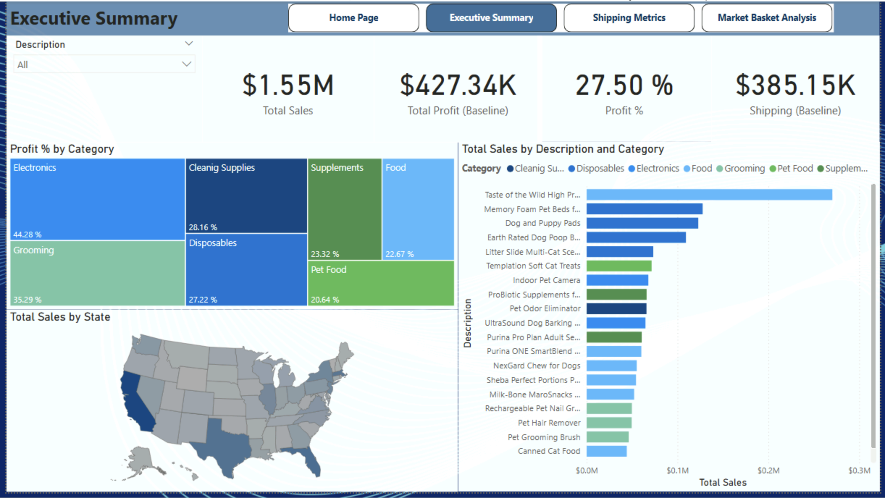
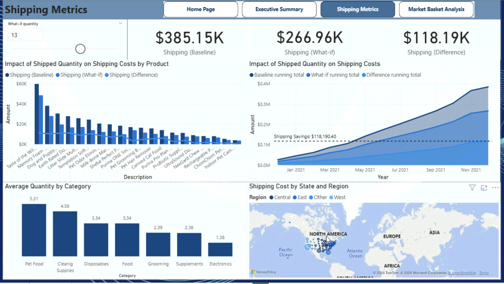
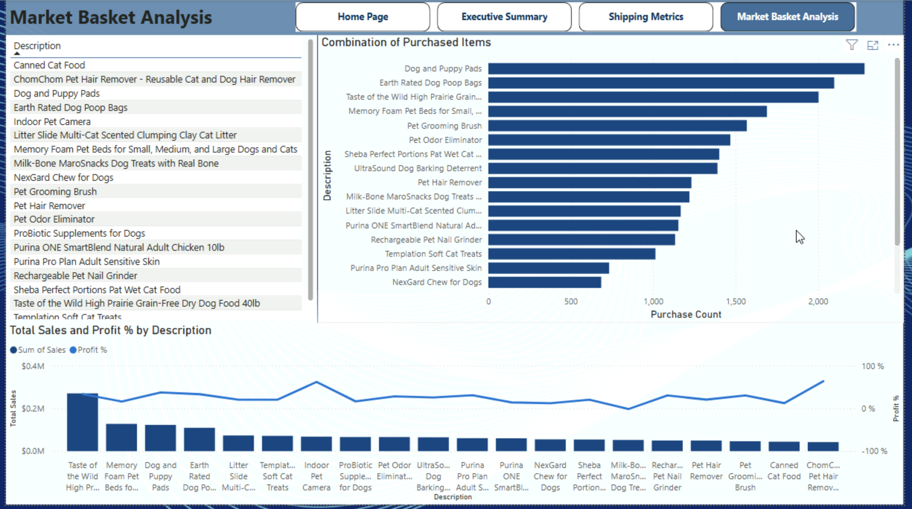

# Ecommerce Data Analysis – Power BI Case Study

## 📌 Project Overview
This project is a case study for *Whiskique*, a fictitious online pet supply company.  
The goal was to analyze ecommerce data and uncover insights into *sales performance, **shipping costs, and **cross-sell opportunities* using *Power BI*.

## 🔧 Process
- Data cleaning and preparation from multiple CSV files (Sales, Customers, Products, State Mapping).  
- Data modeling and creation of relationships between tables.  
- Building *interactive Power BI dashboards* with KPIs and drill-down capabilities.  
- Performing *Market Basket Analysis* to identify product combinations.  
- Running *what-if shipping simulations* to evaluate cost-saving strategies.  

## 📊 Dashboards
- *Executive Summary*: Sales, Profit %, KPIs by Category and State  
- *Shipping Metrics*: What-if analysis on shipping costs, category averages, geographic trends  
- *Market Basket Analysis*: Product combinations frequently purchased together  

## 🚀 Key Insights
- Cross-sell promotions (e.g., Dog Pads + Poop Bags) present strong growth opportunities.  
- Optimizing shipping (consolidation, package size, higher quantity per shipment) can save > $118K annually.  
- Electronics and Grooming categories show the highest profit margins.  

## 📸 Dashboard Samples

  

## 🎥 Project Demo (Screen Recording)
👉 [Watch the dashboard walkthrough here](Ecommerce_PowerBI_Dashboard.mov)

## 🛠 Tools & Skills
- Power BI  
- Data Modeling & DAX  
- Data Visualization & Dashboard Design  

---
✨ This case study demonstrates how Power BI can transform raw ecommerce data into actionable insights that support business decisions.
